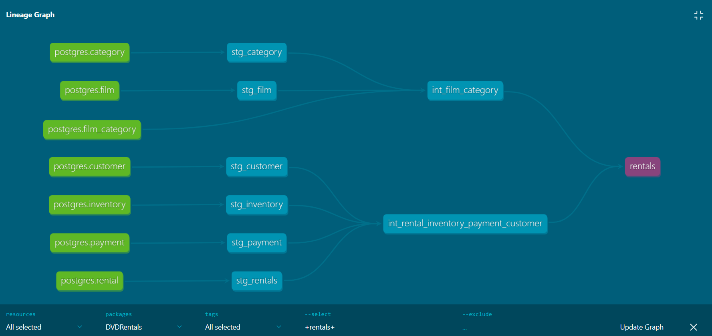

# DVD rentals Postgres database DBT Core project

### This DBT project was designed to address good practices for structuring projects in DBT. As a database, the Postgres example database was used - DVD rentals - one of the most used in Postgres for testing and learning with the Postgres database.

## Objective

#### The objective of this project is to structure data extraction into staging, intermediate and analytics layers, following good practices recommended in the DBT documentation. The final resulting table will be used as a data source in a Business Intelligence project in Power BI.

## About data source

#### The set of tables used in this project consists of financial transaction data, customer and account data, information about location and date. This same database is used in DBT courses taught by the Data Engineering Academy of Brazil.

## Source

#### Some DVD rentals database tables are used in the DBT project source
&nbsp;
```yml
sources:
  - name: postgres
    database: DVDRental
    schema: bronze
    tables:
      - name: rental
        tags: ['rental']
      - name: customer
        tags: ['rental', 'customer']
      - name: payment
        tags: ['rental', 'payment', 'customer']
      - name: inventory
        tags: ['rental', 'store', 'inventory', 'film']
      - name: film
        tags: ['film', 'inventory', 'rental']
      - name: film_category
        tags: ['film_category', 'film']
      - name: category
        tags: ['film', 'category']
      - name: staff
        tags: ['staff', 'rental']
      - name: address
        tags: ['address', 'customer']
```

## Custom schemas

#### For this project, different schemas were defined for each layer in the models.
&nbsp;
```yml
models:
  DVDRentals:
    # Config indicated by + and applies to all files under models/
    staging:
      +materialized: table
      +schema: staging
    intermediate:
      +materialized: table
      +schema: intermediate
    analytics:
      +materialized: table
      +schema: analytics
```
#### To create customized schemas, a macro is commonly used to define the personalized name of the schema. This code is even present in the DBT documentation.
&nbsp;
~~~~sql

    
    
        {{ default_schema }}
    
        {{ custom_schema_name | trim }}
    

~~~~

## Documentation

#### The documentation for this DBT project visually provides how each layer is constructed and how they relate to each other. The final table provides the insight for project analytics.

&nbsp;


## Author
- Tiago Bratz Heck
##### Access my [LinkedIn](https://www.linkedin.com/in/tiago-bratz-heck-0b9b5696/) profile.